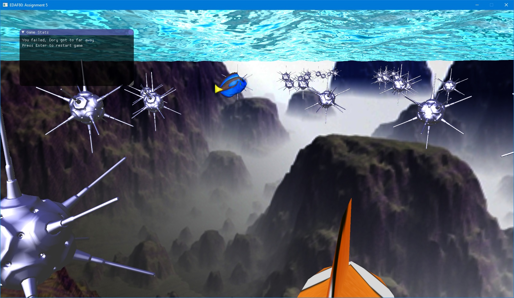

# Follow Dory

## Storyline

You are Martin in the Ocean.
Follow Dory to find Nemo.
Don't loose Dory or hit mines, otherwise you will not find your way.

## Authors

Niklas Karlsson & Rapha�l Castanier

## Features

- Collision detection using object radius
- Path generation and interpolation
- Game functionalities (play/pause, countdown, restart)
- GUI Feedback
- Loading objects (shapes and textures)
- Shaders (texture, cubemap, water, phong)

## Pictures

Countdown before game starts:

Follow Dory without touching mines:

Dory got too far away:

## Credits to

Phaddergroup 1 : Finding Nemo
